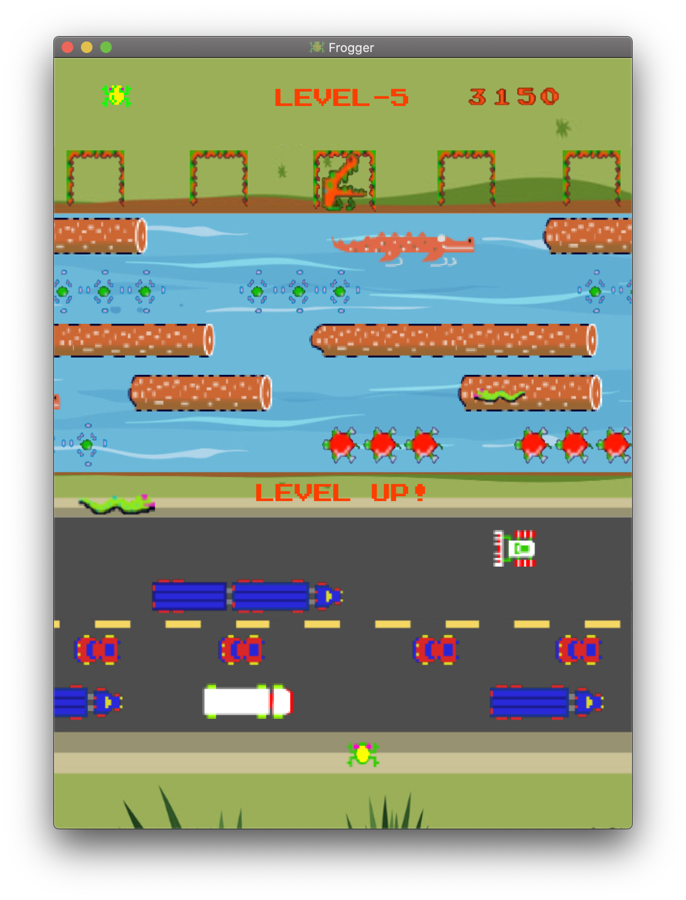

# README

## Info

* Build script: Maven.

* Tested on: Mac/Windows/Linux, IntelliJ IDEA Ultimate 2019.3, JDK 13.

* Project log: [Frogger.log](Frogger.log).

* Game screenshot: 

## Maintenance

### 1. Project Organisation

* Standardised Maven structure, managed dependencies.

* Packaging of source code: model, controller, test.

* Categorised resources: view, CSS, images, sounds, fonts.

### 2. Refactoring

* Frog
    * The first stage focused on reformatting, renaming and extracting methods. This process brought enhanced readability and reduced duplication of the code, while establishing a clearer understanding to the purposes of fields and methods.
    * A further refactoring took place later on transferring the controls of Frog to GameController, to enhance the separation of model and controller and bring higher clarity to the code.

* World
    * BackgroundMusic was extracted from MyStage and applied with singleton pattern to enforce the use of a single instance, therefore facilitate further extensions and features such as muting and pausing.
    * Abstract class MyStage was removed and the World class was made concrete.
    * The responsibility of handling events was extracted to GameController, leaving World with the single purpose of managing Actors.

* General
    * A MovingActor class was abstracted from actors with customisable speed to facilitate the implementation of related features such as speeding up moving actors on level up.
    * Visibility of fields and methods within or among packages was carefully managed.
    * Unused fields and methods were eliminated.
    * Enforced encapsulation where appropriate.

### 3. Debugging

* Bugs were discovered along the refactoring and immediately fixed on separate branches. The most important fixes include:  
    * Score calculation and display logic.
    * Handling of key events.
    * Death checking logic.
    * Movement issues between lanes and around boundaries.

### 4. MVC

* The project adheres the MVC pattern. This separates design, data/behaviour and event controlling, while providing a convenient link in between.

* Initialisation of Actor objects were translated to FXML tags in GameView.fxml, hence eliminating most of the raw use of constructors and the need of introducing any form of factory pattern.

* FXML and CSS were used for the design of views, enabling the views to be implemented with little effort.

### 5. Testing

* Unit tests focusing on abstract models such as Actor were implemented prior to any refactoring for the preservation of core functionality and its correctness.

* Unit tests for concrete models such as Obstacle were created along the refactoring of the respective classes.

### 6. Documentation

* Primary inline comments were written along the refactoring and extension process.

* Javadoc was written at the final stage based on existing inline comments, providing a systematic and user-friendly guide for future maintenance and development.

## Feature

### 1. Game Rule

* Infinite game, limited number of lives.

* Levels:
    * Level 1: Ordinary obstacles, logs, turtles and wet turtles. Slow speed.
    * Level 2: Random crocodile heads and flies start to emerge in slots. Increased speed.
    * Level 3: Snakes start to appear in middle lane. Medium speed.
    * Level 4: Introducing swimming crocodiles. Increased speed.
    * Level 5: Occasional snakes on logs. High speed.
    * Level 6 and onwards: Same as level 5.

* Bonus points for catching a fly.

* Bonus life on occasion.

### 2. New Functionality

* Pausing with SPACE and muting with M.

* Home page and help page.

* A leaderboard that records the top 10 high scores.

### 3. Easter Egg

* A snowy theme can be activated or deactivated by typing "scyjc1" (which is my university username obviously) during the game. Do not hesitate to try it out!
